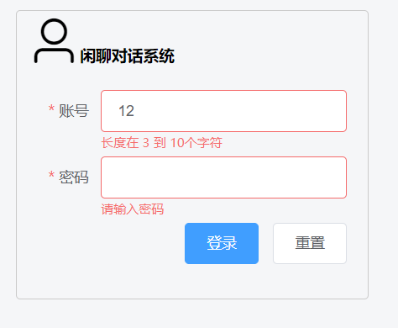
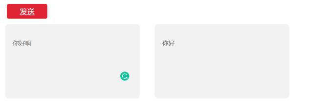
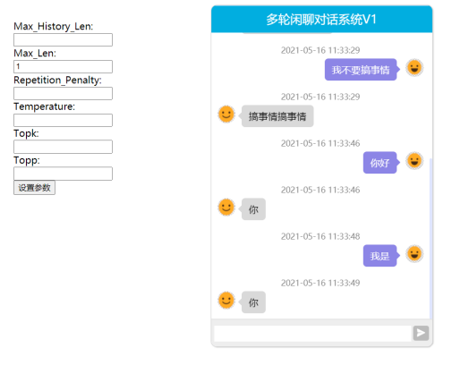
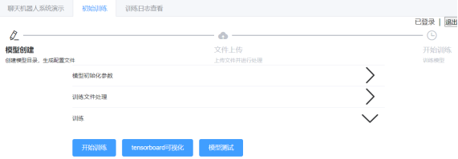

> 对话使用该开源模型https://github.com/yangjianxin1/GPT2-chitchat

> @vue/cli 4.5.6
>
> Flask 1.1.2
>
> transformers 2.11
>
> torch 1.8.1

## 闲聊对话系统

### 系统主要功能

前端界面功能：

- 用户登录

- 对话测试

- 模型训练

- tensorboard与日志查看

## 系统运行

### chitchat-vue

前端vue：

`npm install`下载依赖

`npm run dev` 启动项目

### chitchat 后端

`python api_service.py`启动后端服务

`python app_chatUI/app.py`启动多轮对话页面，集成的其他开元项目，自己写不了这样的前端效果~。

> 模型，词表文件，配置文件 在dialogue_model目录下，模型可在GPT2-chitchat开源项目下下载。

